# E-Commerce Application

This project is a full-stack e-commerce application with a React frontend and a Spring Boot backend connected to a MySQL database.

## Frontend

- Built with React and Redux.
- Communicates with the backend API for authentication, product management, user profile, and admin operations.
- Uses JWT for authentication.
- API base URL is configured in `src/config/api.js`.

## Backend

- Built with Spring Boot.
- Provides RESTful APIs for authentication, user management, product management, and admin operations.
- Uses Spring Security with JWT for authentication and authorization.
- Connects to a MySQL database for data persistence.

## Prerequisites

- Node.js and npm installed (for frontend)
- Java 17+ and Maven installed (for backend)
- MySQL server installed and running

## Setup Instructions

### Frontend

1. Navigate to the project root directory.
2. Install dependencies:
   ```
   npm install
   ```
3. Start the frontend development server:
   ```
   npm start
   ```
4. The frontend will run on `http://localhost:3000`.

### Backend

1. Navigate to the `backend` directory.
2. Configure MySQL database connection in `src/main/resources/application.properties`:
   ```
   spring.datasource.url=jdbc:mysql://localhost:3306/ecommerce_db?useSSL=false&serverTimezone=UTC
   spring.datasource.username=your_mysql_username
   spring.datasource.password=your_mysql_password
   spring.jpa.hibernate.ddl-auto=update
   ```
3. Build and run the Spring Boot application:
   ```
   mvn clean install
   mvn spring-boot:run
   ```
4. The backend will run on `http://localhost:5454`.

### Database

1. Create a MySQL database named `ecommerce_db`.
2. The backend will automatically create/update tables on startup.

## API Endpoints Overview

- `POST /auth/signup` - User registration
- `POST /auth/signin` - User login
- `GET /api/users/profile` - Get logged-in user profile
- `GET /api/admin/users` - Get all users (admin only)
- `GET /api/products` - Get products with filters
- `GET /api/products/id/{id}` - Get product by ID
- `GET /api/products/search?q=keyword` - Search products
- `POST /api/admin/products` - Create product (admin only)
- `PUT /api/admin/products/{id}` - Update product (admin only)
- `DELETE /api/admin/products/{id}/delete` - Delete product (admin only)

## Notes

- The frontend expects the backend to run on `http://localhost:5454`.
- JWT token is stored in localStorage and sent in Authorization header for protected endpoints.
- Admin endpoints require users with ADMIN role.

## Running the Application

1. Start MySQL server and create the database.
2. Run the backend Spring Boot application.
3. Run the frontend React application.
4. Access the frontend at `http://localhost:3000`.

## License

This project is licensed under the MIT License.
<<<<<<< HEAD
=======

# Screenshots

- 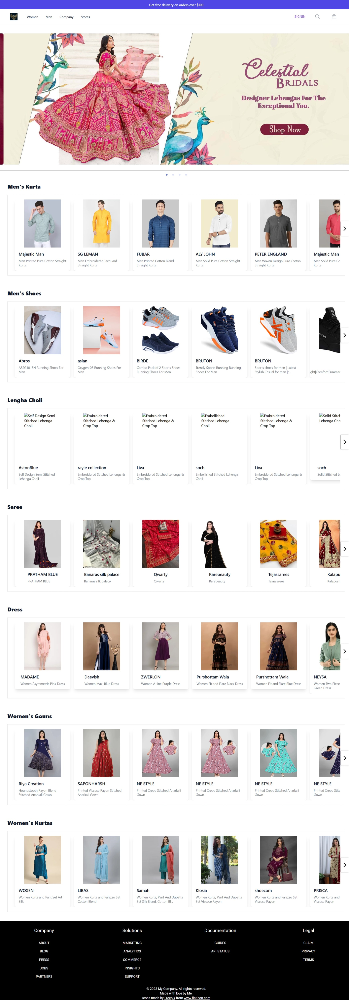 
- 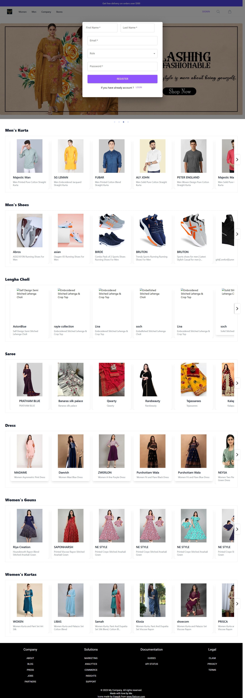 
- 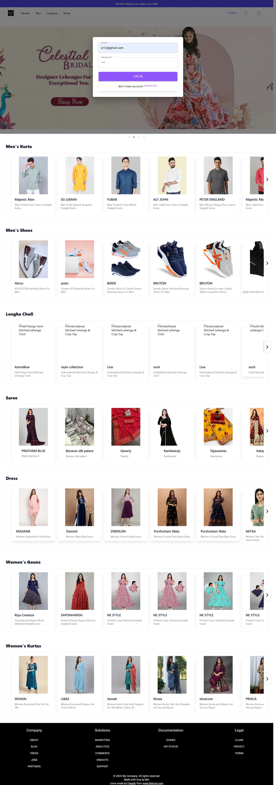 
- 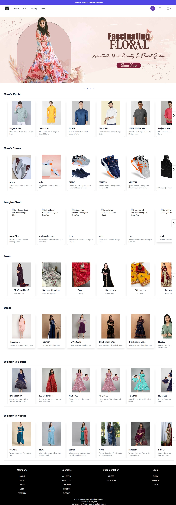
- 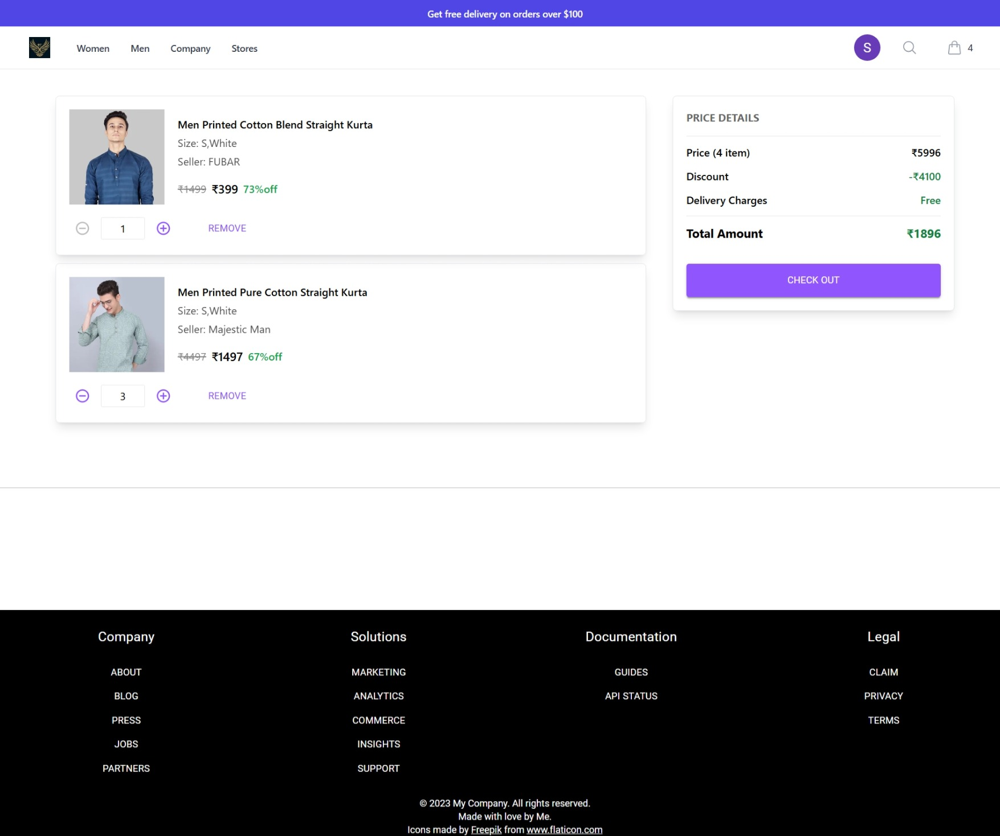
- 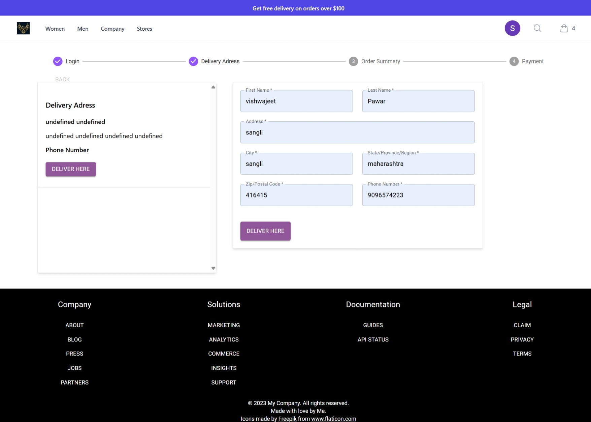 
- 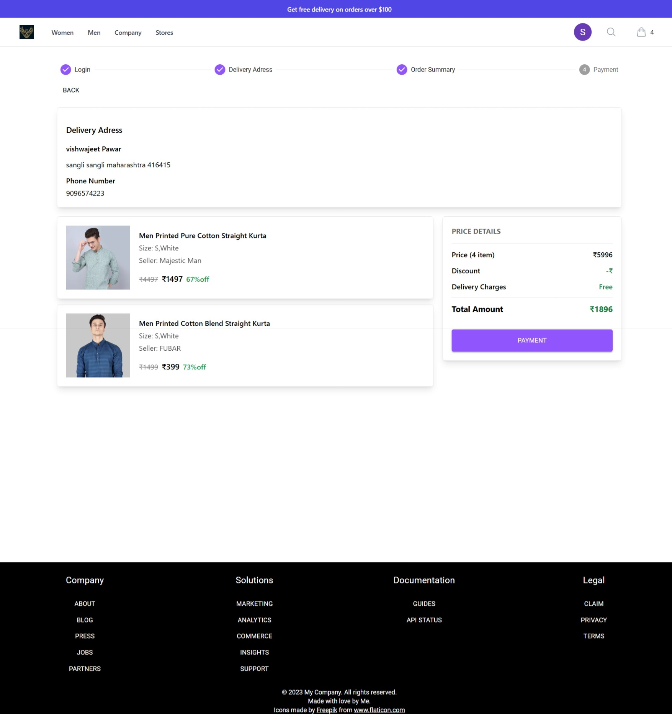 
- 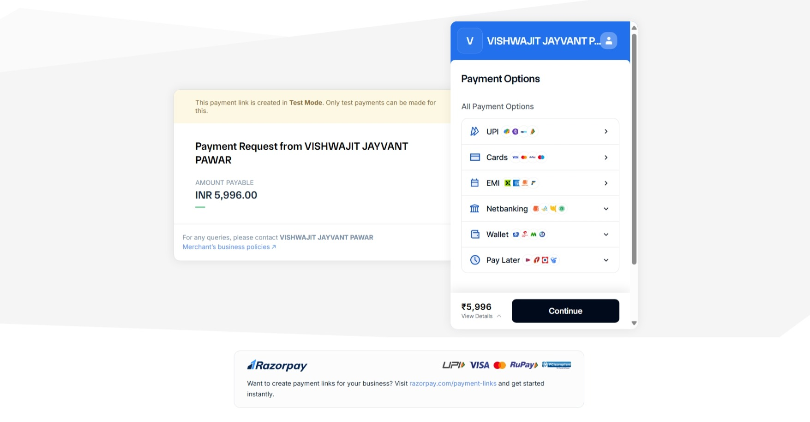 
- 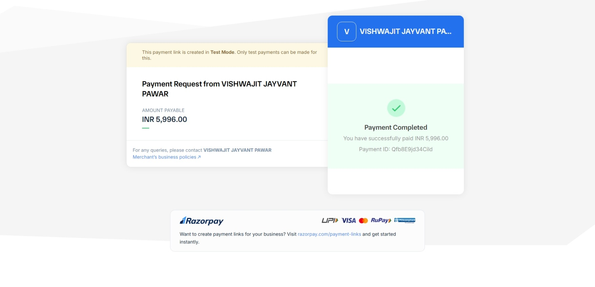
- 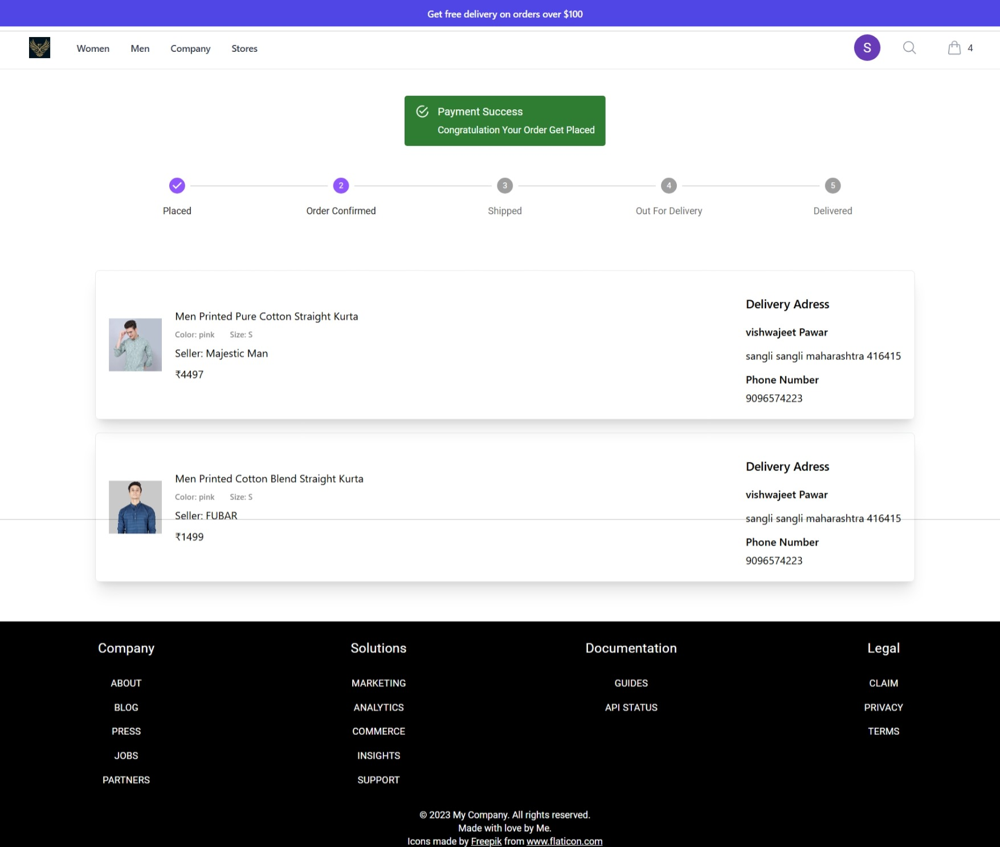
- 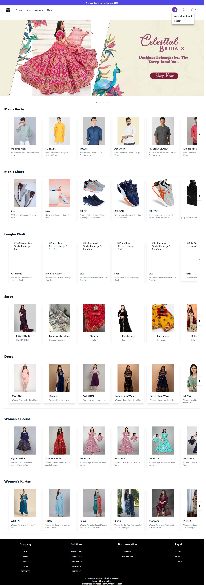
- 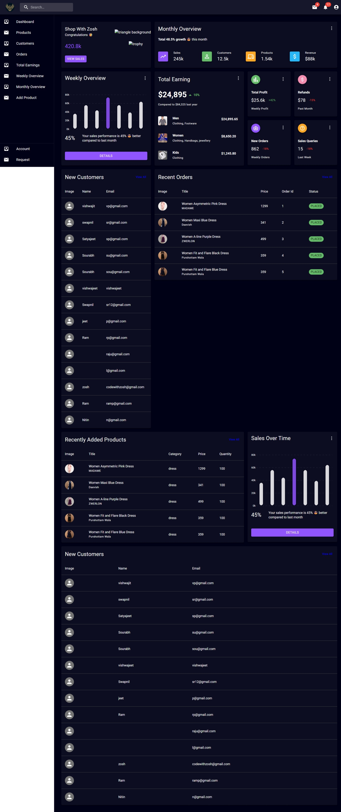
- 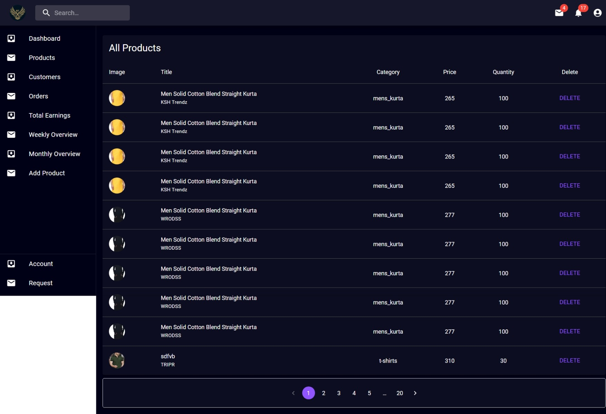
- 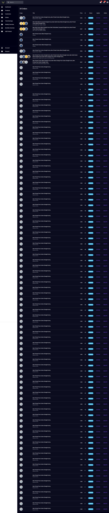
- 
- 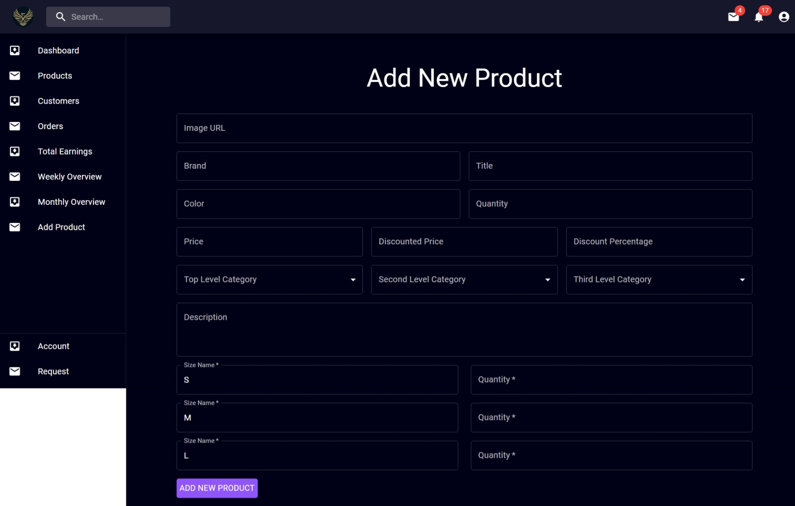

